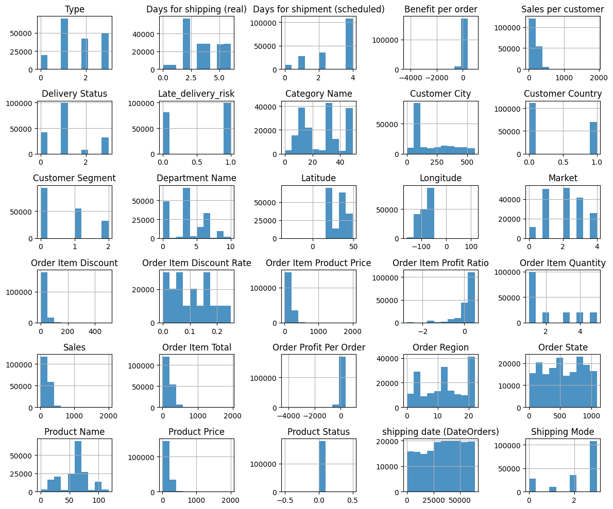
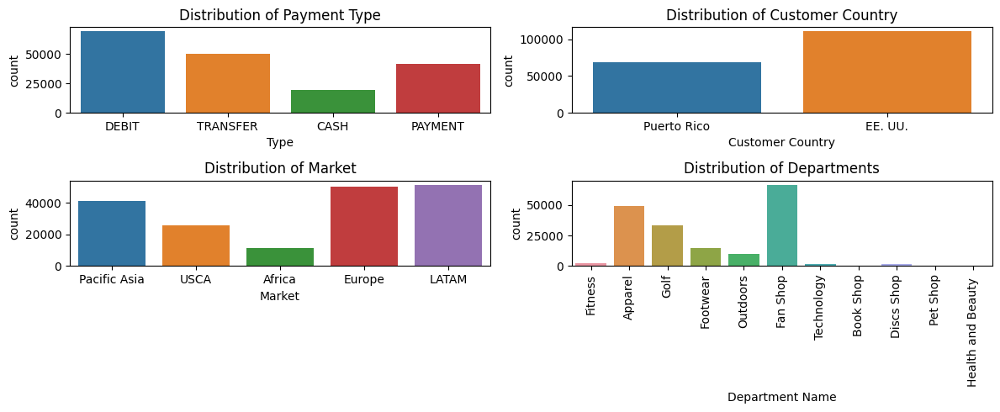

# End-to-End Supply Chain Insights: Big Data Analytics

## Overview

This project offers in-depth analytics, modeling, and mining of a comprehensive supply chain dataset. The notebooks cover data analysis, modeling, and mining, providing valuable insights into various facets of the supply chain, including sales patterns, revenue analysis, delivery performance, and customer behavior.

## Project Structure

### 1. [Data_Analysis.ipynb](./Data_Analysis.ipynb)

- **Objective**: Conduct exploratory data analysis (EDA) and preprocessing of the supply chain dataset.
  
- **Key Features**:
  - Utilizes visualizations like histograms and bar charts to understand categorical data distribution.
  - Performs correlation analysis and box plots to uncover relationships between different features.
  - Drops unused columns, preparing the dataset for modeling.

### 2. [Data_Modeling.ipynb](./Data_Modeling.ipynb)

- **Objective**: Create dimension tables and form a fact table for subsequent analysis.
  
- **Key Features**:
  - Establishes dimension tables for categorical columns.
  - Merges dimension tables to form a fact table, extracting relevant date-related features.
  - Saves dimension tables and the fact table for further analysis.

### 3. [Data_Mining.ipynb](./Data_Mining.ipynb)

- **Objective**: Analyze sales and revenue, evaluate delivery performance, and apply customer RFM (Recency, Frequency, Monetary) analysis.
  
- **Key Features**:
  - Conducts monthly and yearly sales analysis.
  - Evaluates delivery performance, including average delivery time and on-time delivery rate.
  - Applies RFM analysis to identify top customers.
  - Conducts time series analysis of sales and geospatial analysis of customer locations.

## Usage

1. **Data_Analysis.ipynb**: Explore and visualize the supply chain dataset, perform preprocessing, and save the cleaned dataset.

2. **Data_Modeling.ipynb**: Create dimension tables, form a fact table, and extract relevant features for analysis.

3. **Data_Mining.ipynb**: Analyze sales, revenue, and delivery performance. Apply RFM analysis, time series analysis, and geospatial analysis.


## Implementations

## Data Distribution Overview
```python
# label Encoding for object columns in dataset
from sklearn.preprocessing import LabelEncoder

def Change_Obj_Type(data):
    for column in data.columns:
        if data[column].dtype == type(object):
            le = LabelEncoder()
            data[column] = le.fit_transform(data[column])
    return data

hist_data = Change_Obj_Type(hist_data)
hist_data.head()

# Overview of Data Distribution
hist_data.hist(alpha=0.8, figsize=(12, 10))
plt.tight_layout()
plt.savefig('./Results/Plots/data_distribution.png')  # Save the data distribution overview image
plt.show()
```


## Categorical Data Distribution
```python
# Plotting multiple Bar Charts for understanding categorical data distribution
# Customer Country

# Set up for sub plots
fig, axis = plt.subplots(nrows=2, ncols=2, figsize = (12, 5))

#sub plot 1
sns.countplot(x = 'Type', data = supply_dataset, ax=axis[0][0])
axis[0][0].set_title("Distribution of Payment Type")

#sub plot 2
sns.countplot(x = 'Customer Country', data = supply_dataset, ax=axis[0][1])
axis[0][1].set_title("Distribution of Customer Country")

#sub plot 3
sns.countplot(x = 'Market', data=supply_dataset, ax=axis[1][0])
axis[1][0].set_title("Distribution of Market")

#sub plot 4
plot = sns.countplot(x = 'Department Name', data=supply_dataset, ax=axis[1][1])
axis[1][1].set_xticklabels(plot.get_xticklabels(), rotation=90)
axis[1][1].set_title("Distribution of Departments")

# Adjusting layout to prevent overlapping
plt.tight_layout()
plt.savefig('./Results/Plots/categorical_distribution.png')  # Save the  image
# Show Plots
plt.show()

```

## Requirements

- Python 3.x
- Libraries: pandas, matplotlib, seaborn, scikit-learn, geopandas (for geospatial analysis)

## Conclusion

This project provides a comprehensive view of the supply chain, enabling data-driven decision-making and strategic insights. Whether you are interested in sales patterns, customer segmentation, or delivery performance, this project serves as a valuable resource for supply chain analytics.
