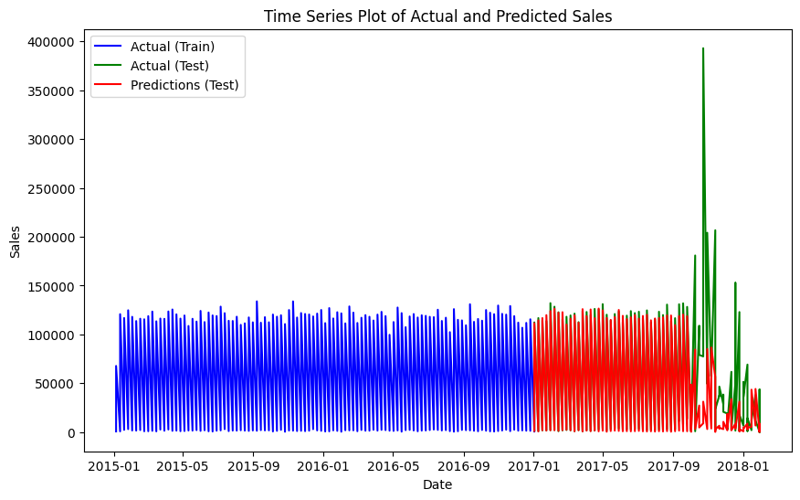

# End-to-End Supply Chain Insights: Big Data Analytics

## Overview

This project offers in-depth analytics, modeling, and mining of a comprehensive supply chain dataset. The notebooks cover data analysis, modeling, and mining, providing valuable insights into various facets of the supply chain, including sales patterns, revenue analysis, delivery performance, and customer behavior.

## Project Structure

### 1. [Data_Analysis.ipynb](./Data_Analysis.ipynb)

- **Objective**: Conduct exploratory data analysis (EDA) and preprocessing of the supply chain dataset.
  
- **Key Features**:
  - Utilizes visualizations like histograms and bar charts to understand categorical data distribution.
  - Performs correlation analysis and box plots to uncover relationships between different features.
  - Drops unused columns, preparing the dataset for modeling.

### 2. [Data_Modeling.ipynb](./Data_Modeling.ipynb)

- **Objective**: Create dimension tables and form a fact table for subsequent analysis.
  
- **Key Features**:
  - Establishes dimension tables for categorical columns.
  - Merges dimension tables to form a fact table, extracting relevant date-related features.
  - Saves dimension tables and the fact table for further analysis.

### 3. [Data_Mining.ipynb](./Data_Mining.ipynb)

- **Objective**: Analyze sales and revenue, evaluate delivery performance, and apply customer RFM (Recency, Frequency, Monetary) analysis.
  
- **Key Features**:
  - Conducts monthly and yearly sales analysis.
  - Evaluates delivery performance, including average delivery time and on-time delivery rate.
  - Applies RFM analysis to identify top customers.
  - Conducts time series analysis of sales and geospatial analysis of customer locations.

## Usage

1. **Data_Analysis.ipynb**: Explore and visualize the supply chain dataset, perform preprocessing, and save the cleaned dataset.

2. **Data_Modeling.ipynb**: Create dimension tables, form a fact table, and extract relevant features for analysis.

3. **Data_Mining.ipynb**: Analyze sales, revenue, and delivery performance. Apply RFM analysis, time series analysis, and geospatial analysis.


## Implementations

## Data Distribution Overview
```python
# label Encoding for object columns in dataset
from sklearn.preprocessing import LabelEncoder

def Change_Obj_Type(data):
    for column in data.columns:
        if data[column].dtype == type(object):
            le = LabelEncoder()
            data[column] = le.fit_transform(data[column])
    return data

hist_data = Change_Obj_Type(hist_data)
hist_data.head()

# Overview of Data Distribution
hist_data.hist(alpha=0.8, figsize=(12, 10))
plt.tight_layout()
plt.savefig('./Results/Plots/data_distribution.png')  # Save the data distribution overview image
plt.show()
```


## Categorical Data Distribution
```python
# Plotting multiple Bar Charts for understanding categorical data distribution
# Customer Country

# Set up for sub plots
fig, axis = plt.subplots(nrows=2, ncols=2, figsize = (12, 5))

#sub plot 1
sns.countplot(x = 'Type', data = supply_dataset, ax=axis[0][0])
axis[0][0].set_title("Distribution of Payment Type")

#sub plot 2
sns.countplot(x = 'Customer Country', data = supply_dataset, ax=axis[0][1])
axis[0][1].set_title("Distribution of Customer Country")

#sub plot 3
sns.countplot(x = 'Market', data=supply_dataset, ax=axis[1][0])
axis[1][0].set_title("Distribution of Market")

#sub plot 4
plot = sns.countplot(x = 'Department Name', data=supply_dataset, ax=axis[1][1])
axis[1][1].set_xticklabels(plot.get_xticklabels(), rotation=90)
axis[1][1].set_title("Distribution of Departments")

# Adjusting layout to prevent overlapping
plt.tight_layout()
plt.savefig('./Results/Plots/categorical_distribution.png')  # Save the  image
# Show Plots
plt.show()

```


## Region Wise Orders
```python
# Order Region
plt.figure(figsize=(7,4))
plot = sns.countplot(x='Order Region', data=supply_dataset);
plot.set_xticklabels(plot.get_xticklabels(), rotation=60)
plt.title("Order Regions")
plt.savefig('./Results/Plots/region_wise_orders.png')
plt.show()
```


## Top 10 Customer Cities

```python
# Top ten Customer City
supply_dataset['Customer City'].value_counts()[:10].plot(kind='bar')
plt.title("Top 10 Customer city")
plt.savefig('./Results/Plots/top_10_customer_cities.png')
plt.show()
```


## Top 15 Category of goods
```python
# Top 15 Category of goods
supply_dataset['Category Name'].value_counts()[:15].plot(kind='bar')
plt.title("Top 15 Category of goods")
plt.savefig('./Results/Plots/top_15_goods.png')
plt.show()
```


## Shipping Mode Distribution
```python
# Shipping Mode
sns.countplot(x='Shipping Mode', data=supply_dataset)
plt.title('Shipping Mode')
plt.xticks(rotation = 90)
plt.savefig('./Results/Plots/shipping_mode.png')
plt.show()
```


## Top 20 Product Names
```python
# Top 20 Product Name
supply_dataset['Product Name'].value_counts()[:20].plot(kind='bar')
plt.title('Top 20 Product Name')
plt.savefig('./Results/Plots/top_20_products.png')
plt.show()
```


## Correlation Analysis
```python
corr_data = supply_dataset.copy(deep=False)
# drop unused columns
corr_data = corr_data.drop(['Customer Id','order date (DateOrders)', 'Product Status'], axis=1)

# change object type data into int
from sklearn.preprocessing import LabelEncoder
def Change_obj_type(data):
    for column in data.columns:
        if data[column].dtype == type(object):
            le = LabelEncoder()
            data[column] = le.fit_transform(data[column])
    return data
cor_data = Change_obj_type(corr_data)
corr_m = corr_data.corr()
fig, axis = plt.subplots(figsize=(25,18))
plot = sns.heatmap(corr_m, ax = axis, annot=True, cmap="YlGnBu", linewidths=0.1)
plt.xlabel('x label', fontsize = 18)
plt.savefig('./Results/Plots/correlation.png')
plt.show()
```


## Time Series Analysis
```python
import matplotlib.pyplot as plt

# Time Series Analysis of Sales
time_series_sales = fact_table.groupby(['Order Year','Order Month'])['Sales'].sum()

# Plotting Time Series Sales
plt.figure(figsize=(12, 6))
time_series_sales.plot(marker='o')
plt.title('Time Series Analysis of Sales')
plt.xlabel('Year & Months')
plt.ylabel('Sales')
plt.grid(True)
plt.savefig('./Results/Plots/time_series_analysis.png')
plt.show()
```


## Customers Geospatial Analysis
```python
import geopandas as gpd

# Geospatial Analysis of Customer Locations
# Assuming you have latitude and longitude columns in the dataset
gdf = gpd.GeoDataFrame(fact_table, geometry=gpd.points_from_xy(fact_table['Longitude'], fact_table['Latitude']))

# Plotting Customer Locations on a Map
world = gpd.read_file(gpd.datasets.get_path('naturalearth_lowres'))
ax = world.plot(figsize=(15, 10))
gdf.plot(ax=ax, color='red', markersize=10)
plt.title('Geospatial Analysis of Customer Locations')
plt.savefig('./Results/Plots/geospatial.png')
plt.show()
``` 


## XGBoosting Regressor Sale Prediction
```python

# Initialize the XGBoost model with regularization and best parameters based on the grid search
xgb_model = XGBRegressor(
    objective='reg:squarederror',
    reg_alpha=0.1,  # L1 regularization term (adjust as needed)
    reg_lambda=1.0,  # L2 regularization term (adjust as needed)
    learning_rate = 0.2,
    max_depth = 4,
    min_child_weight = 3,
    n_estimators = 200,
    random_state=42
)

# Apply log transformation to target variable to handle potential negative predictions
y_train_transformed = np.log1p(y_train)  # log(1 + y)
y_test_transformed = np.log1p(y_test)

X_train_np = X_train.to_numpy()
X_test_np = X_test.to_numpy()
# Train the model on the training set using 'fit' method
xgb_model.fit(X_train_np, y_train_transformed)

# Make predictions on the test set
y_pred_transformed = xgb_model.predict(X_test_np)
y_pred = np.expm1(y_pred_transformed)

# Model Evaluation
# Calculate Mean Square Error
mse = mean_squared_error(y_test, y_pred)

# Calculate R-squared
r2 = r2_score(y_test, y_pred)

# Calculate Mean Absolute Error (MAE)
mae = mean_absolute_error(y_test, y_pred)

# Print the evaluation metrics
print(f"Mean Squared Error (MSE): {mse}")
print(f"R-squared: {r2}")
print(f"Mean Absolute Error (MAE): {mae}")

# Time Series Plot for Actual and Predicted data
# Convert 'year' and 'week' to datetime index
grouped_data['Date'] = pd.to_datetime(grouped_data['year'].astype(str) + grouped_data['week'].astype(str) + '1', format='%Y%W%w')

# Plot actual values and predictions
plt.figure(figsize=(10, 6))
plt.plot(grouped_data['Date'][train_mask], y_train, label='Actual (Train)', color='blue')
plt.plot(grouped_data['Date'][test_mask], y_test, label='Actual (Test)', color='green')
plt.plot(grouped_data['Date'][test_mask], y_pred, label='Predictions (Test)', color='red')
plt.xlabel('Date')
plt.ylabel('Sales')
plt.title('Time Series Plot of Actual and Predicted Sales')
plt.legend()
plt.show()

```


## Requirements

- Python 3.x
- Libraries: pandas, matplotlib, seaborn, scikit-learn, geopandas (for geospatial analysis)

## Conclusion

This project provides a comprehensive view of the supply chain, enabling data-driven decision-making and strategic insights. Whether you are interested in sales patterns, customer segmentation, or delivery performance, this project serves as a valuable resource for supply chain analytics.
